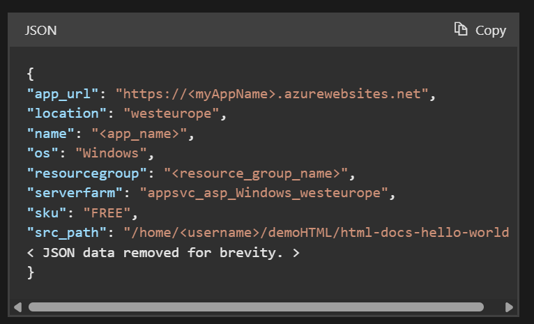
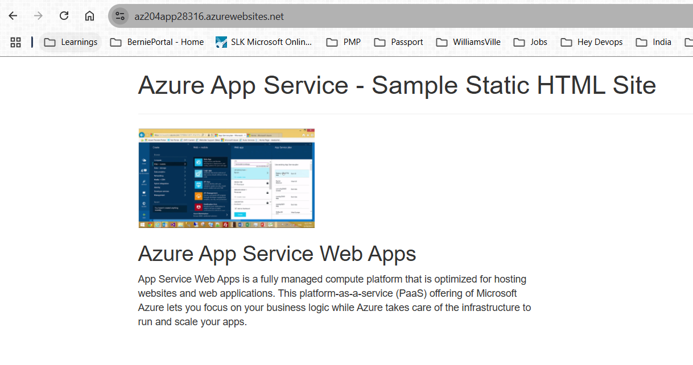
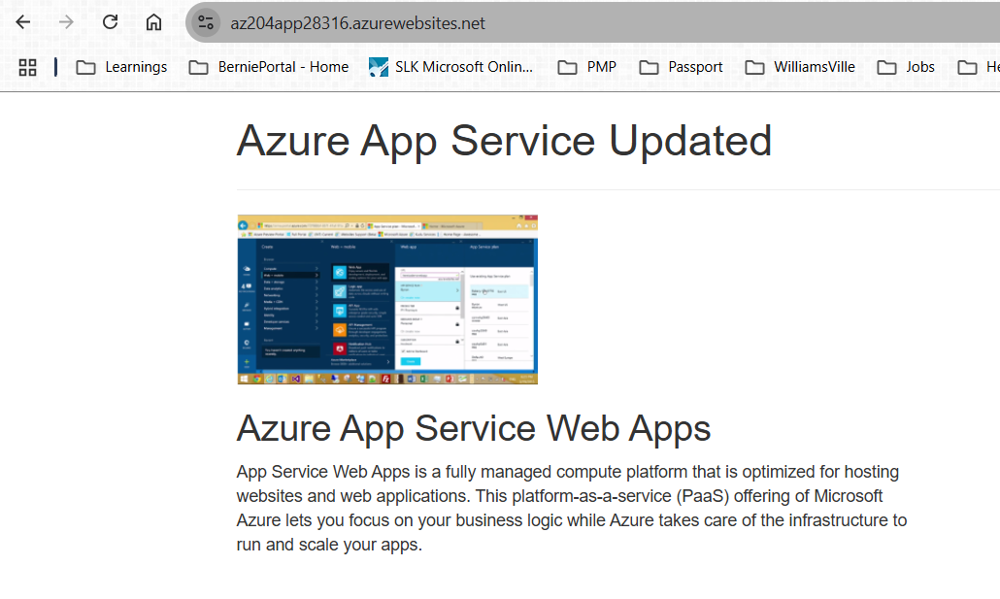

In this exercise, you deploy a basic HTML+CSS site to Azure App Service by using the Azure CLI az webapp up command. Next, you update the code and redeploy it by using the same command.

The az webapp up command makes it easy to create and update web apps. When executed, it performs the following actions:

Create a default resource group if one isn't specified.
Create a default app service plan.
Create an app with the specified name.
Zip deploy files from the current working directory to the web app.
 Important

In order to complete this exercise, you need to switch the Cloud Shell to the Classic version. When the Cloud Shell finishes loading select Settings from the menu at the top of the Cloud Shell, and then select Go to Classic version of Bash

1. create a directory and then navigate to it.
mkdir htmlapp

2. cd htmlapp
3. Run the following git command to clone the sample app repository to your htmlapp directory.
git clone https://github.com/Azure-Samples/html-docs-hello-world.git
4. Set variables to hold the resource group and app names by running the following commands.

resourceGroup=$(az group list --query "[].{id:name}" -o tsv)
appName=az204app$RANDOM

5. Create the web app - Change to the directory that contains the sample code and run the az webapp up command.

cd html-docs-hello-world
az webapp up -g $resourceGroup -n $appName --html

This command might take a few minutes to run. While the command is running, it displays information similar to the following example.

6. Open a new tab in your browser and navigate to the app URL (https://<myAppName>.azurewebsites.net) and verify the app is running - take note of the title at the top of the page. Leave the browser open on the app for the next section.

7. Update and redeploy the app
In the Cloud Shell, type code index.html to open the editor. In the <h1> heading tag, change Azure App Service - Sample Static HTML Site to Azure App Service Updated - or to anything else that you'd like.

Use the commands ctrl-s to save and ctrl-q to exit.

8. Redeploy the app with the same az webapp up command you used earlier.

az webapp up -g $resourceGroup -n $appName --html 

After deployment is completed switch back to the browser from step 2 in the "Create the web app" section and refresh the page.
