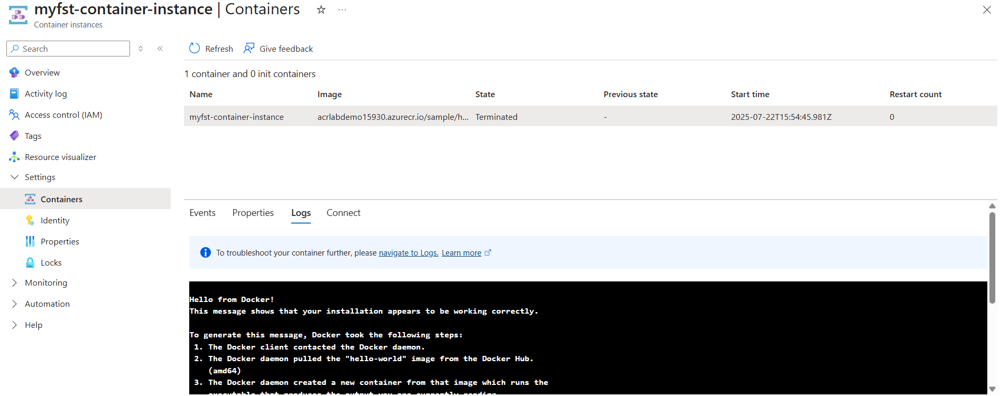

# Deploy an Image to Azure Container Instances (ACI)

1. On the portal navigate to the resouce group on which you created your ACR
2. Click on Create
3. Search and click on Container Instances
4. Click and Create with a any name 
5. make sure you select ACR as Image Source
6. Select the image you created earlier
7. click Review and create
8. Once it is created , navigate to the resource
9. Click Start to start your container
10. Once it is started
11. navigate to Containers under Settings
12. click on logs to verify that container is all set and running.

