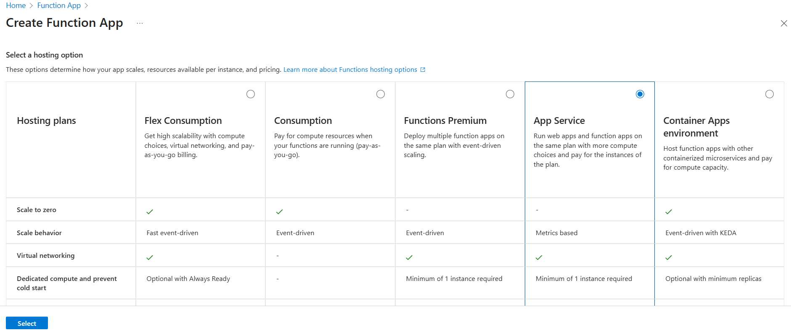
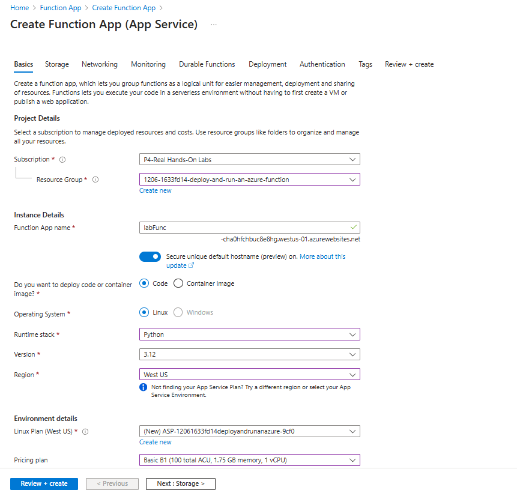

# Deploy and Run an Azure Function
1. Deploy an Azure Function
 - Log in to the Azure portal.
 - Deploy an App Service style Function App in the same region as your resource group.
    - Search for function App
    - click on Create
    - from the list of Hostings,select App Service
    - click on select 
    
 - Select same region as your resouce group
 - For the runtime stack, choose Python with the latest version.
 - Ensure the pricing plan is set to Basic B1
 
 - click on Review and Create

 2. Create a Sample Application
  - Using VScode, create a new Function Project with Python as the language.
  - Select the HTTP trigger template.
  - Set the authorization level to ANONYMOUS.
  - On VS Code , once signed into Azure account , navigate to function app that was created via portal
  - while on the function_app.py from sample project
  - right click on your unction app that was created via portal , click on "Deploy to Function App"
  - 
  - Copy the function app URL and Supply a name to the http function by using the following parameter: ?name=YOURNAME
  -validate the function